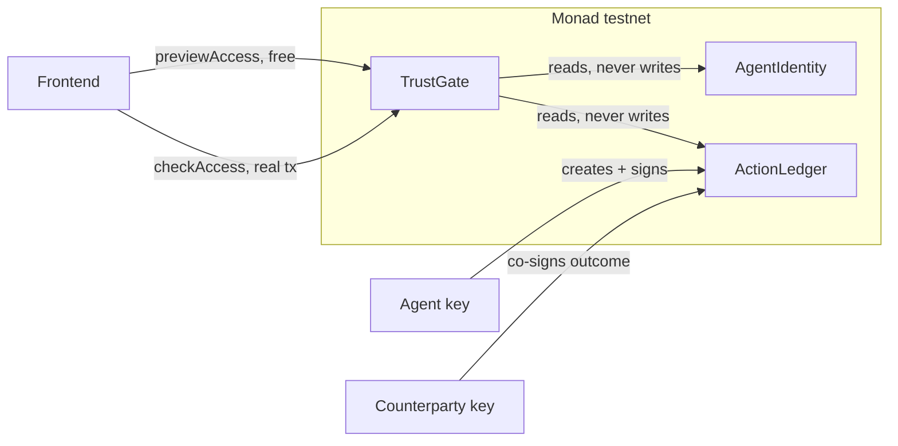
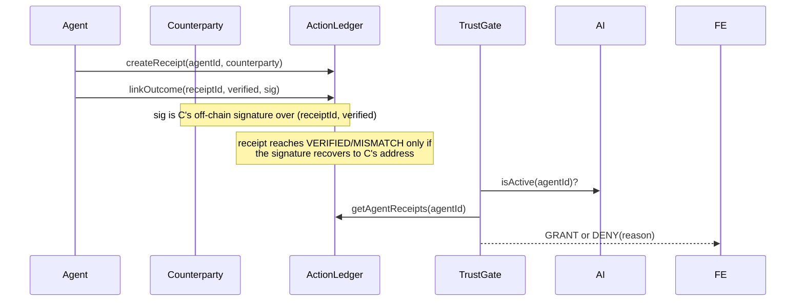

# TrustGate - Plan

## Goal Capsule

- **Objective**: Ship a working TrustGate demo on Monad testnet by 18:30 today — three fresh contracts (`AgentIdentity`, `ActionLedger`, `TrustGate`), real bilaterally-signed on-chain history generated live, a public frontend, and a rehearsed 5-minute demo.
- **Authority hierarchy**: Official Monad Blitz rules (`monad/monad-blitz-full-docs.md`) outrank this plan. This plan outranks any design carried over from the prior SafeReceipt project — that project's code is not reused (see Scope Boundaries).
- **Execution profile**: 2-person team. Eng writes all code. Lead owns content, logistics, testing, and demo delivery. See Team & Execution Model.
- **Stop conditions**: Work to 18:30 as the deadline (on-site notes suggest 19:00; unconfirmed, do not rely on the later time — see `monad/final-idea-selection.md`). If a unit overruns its Sequencing slot, cut UI polish first, never the live demo core.
- **Tail ownership**: Eng deploys the frontend and confirms all Sourcify/Explorer links. Lead owns the MOJO submission and delivers the narrative half of the demo.

---

## Product Contract

### Summary

TrustGate is a Monad testnet contract that gates access based on an AI agent's on-chain history — history that only counts once both the agent and its counterparty have signed off. It fixes a documented flaw in the live ERC-8004 reputation standard: unverified, one-sided feedback.

### Problem Frame

A 2026 empirical study of the ERC-8004 Reputation Registry (arxiv.org/abs/2606.26028) found 59.2%-90.6% of feedback across Ethereum, BSC, and Base shows Sybil patterns, because feedback is self-reported and never grounded in a verifiable interaction. After filtering Sybil feedback, 15.8%-86.8% of rated agents are left with no valid score. Reputation exists on paper; it carries no real signal and no real consequence.

TrustGate answers the rules' own framing question ("我在 Monad 上解决了什么新问题？或者我如何以全新的方式解决了一个老问题？") with the specific documented failure mode above, fixed by a mechanism — bilateral signatures — that only becomes economically viable at Monad's gas and finality profile (KTD1).

### Requirements

**Compliance**
- R1. Every contract, commit, and deployed address is created fresh in a new repository, git-initialized after 11:00 today. No file, address, or asset from the prior SafeReceipt project is reused.

**Contract behavior**
- R2. Three contracts — `AgentIdentity`, `ActionLedger`, `TrustGate` — are written, tested, and deployed to Monad testnet during the event window.
- R3. `ActionLedger.linkOutcome` only sets a receipt to `VERIFIED`/`MISMATCH` when a valid ECDSA signature from the receipt's registered counterparty accompanies the call. The agent alone cannot write history.
- R4. `TrustGate.checkAccess` is a state-changing call emitting `AccessGranted`/`AccessDenied`. `previewAccess` is a view function with identical logic, for free UI feedback before the user spends gas.
- R5. Access policy evaluates four branches in order: revoked agent denies; any `MISMATCH` receipt denies; zero `VERIFIED` receipts denies; otherwise grants. A denial is a return value and an event, never a revert.
- R6. Real on-chain history is generated during the build window: at least one agent with a bilaterally-signed `VERIFIED` receipt, one with a `MISMATCH` receipt, ideally one with zero receipts.

**Frontend**
- R7. A public frontend lets a user pick a seeded agent, see its real `previewAccess` verdict for free, then fire a real `checkAccess` transaction and see the mined result with a Monad Explorer link.

**Submission**
- R8. Contracts are verified on Sourcify. The frontend is deployed to a public URL. The GitHub repo is public with every commit timestamped inside the event window.
- R9. The team is registered on MOJO, the project is submitted before the deadline, and the team has voted for other projects (activity requirement per rules).
- R10. The 5-minute demo slot delivers the live GRANT/DENY flow as its core, states the KTD1 honest limitation before being asked, and has a pre-captured fallback (screenshots plus a short recording) ready.

### Scope Boundaries

**Out of scope**
- Full commit-reveal or re-execution verification of an outcome's truth. The bilateral signature proves both parties agreed, not that the underlying claim is objectively true.
- Defense against a single operator controlling both the agent's and the counterparty's keys (collusion). Named as the next step in KTD1, not built today.
- Configurable policy thresholds, a fleet dashboard, agent-controlled signing keys.

**Deferred to follow-up work**
- Stake-and-challenge economics on top of KTD1 (making a false claim cost money, not just require a second signature) — a real stretch goal only if U1-U5 finish with time to spare. If started and abandoned, remove it before submission (see Definition of Done).

### Sources

- ERC-8004 empirical study: arxiv.org/abs/2606.26028
- Official rules and demo-format guidance: `monad/monad-blitz-full-docs.md`
- Monad gas and execution-model docs: `docs.monad.xyz/developer-essentials/gas-pricing`, `docs.monad.xyz/developer-essentials/differences`
- On-site briefing (MVP bar, deadline note, wallet recommendation): `monad/material/introduction.md`
- Prior direction survey and competitor research: `monad/idea-brainstorm.md`, `monad/final-idea-selection.md`

---

## Planning Contract

### Key Technical Decisions

- KTD1. **Verification requires the counterparty's signature, not the agent's say-so.** `ActionLedger.createReceipt(agentId, counterparty)` records who the interaction was with. `linkOutcome(receiptId, verified, signature)` requires an ECDSA signature (OpenZeppelin `ECDSA.recover`) from that counterparty over `(receiptId, verified)`. Fixes the exact "unverified feedback" gap named in the Problem Frame. Disclosed limitation: defeats a lone liar, not two colluding keys under one operator — state this in the demo close before anyone asks. *(session-settled: user-directed — chosen over the original caller-asserted stub design after the ERC-8004 study was found: a single-signature claim is exactly what the study showed is broken.)*
- KTD2. **Three fresh, independent contracts; `TrustGate` only reads the other two.** `TrustGate` takes both registry addresses as immutable constructor args and never writes to them. Deploy order: `AgentIdentity`, `ActionLedger`, then `TrustGate` — lets the ledger accumulate real history before the gate exists.
- KTD3. **State-changing gate call with a view twin.** A pure `view` check is invisible in a live demo: no transaction, no hash, nothing to watch resolve. `checkAccess` is a real transaction; `previewAccess` is a free `view` twin with identical logic so the UI can show a prediction before the user pays gas. Tests assert the two agree on every seeded scenario.
- KTD4. **Emit-and-return-false on deny, never revert.** A reverted transaction reads as "Failed" on Monad Explorer and still costs gas. Denial is a legitimate outcome: `checkAccess` always returns a `bool` and always emits exactly one event. It may still revert on genuinely invalid input (e.g. a non-existent `agentId`) — confirm `AgentIdentity.isActive()`'s actual behavior on an unregistered id once U1 writes it, rather than assuming revert-vs-`false`.
- KTD5. **Four-branch policy, evaluated in order:** `!isActive(agentId)` denies with `AGENT_REVOKED`; any `MISMATCH` receipt denies with `MISMATCH_ON_RECORD`; zero `VERIFIED` receipts denies with `INSUFFICIENT_HISTORY`; otherwise grants. Seed U3's history to deliberately hit GRANT and `MISMATCH_ON_RECORD` so the demo shows more than one binary case.
- KTD6. **Unbounded loop over `agentReceipts` is an accepted tradeoff.** Negligible at demo scale (single-digit receipts per agent). A known anti-pattern at production scale, named rather than silently shipped.
- KTD7. **The 2-person team splits by skill, not by unit boundary.** *(session-settled: user-directed — chosen over a 3-role technical split from an earlier discarded direction: this team has one non-technical member, so the split follows what each person can actually do.)* See Team & Execution Model.
- KTD8. **Gas and deploy-wallet handling.** Set gas price explicitly at or above 100 MON-gwei on every transaction — the hackathon's own community resource page states 50 gwei, which is wrong; the official docs state 100. Monad charges by `gas_limit`, not `gas_used`, so set gas limits explicitly rather than trusting wallet auto-estimation (MetaMask's/Rabby's revert-fallback behavior of raising the limit is costly here in a way it isn't on Ethereum). Keep the deploy and demo wallet funded well above the day's minimum need, because Monad's Reserve Balance mechanism can revert an already-included, gas-paid transaction if the wallet is underfunded relative to it — a failure mode that looks exactly like a contract bug.

### Team & Execution Model

Two people. **Eng** has strong technical skills. **Lead** has weaker technical background — not zero — and owns submission, content, and demo delivery. The names reflect role, not seniority.

**Eng owns the logic in every code-touching unit, sequentially: U1 to U4, plus U5's transaction/state wiring.** Nothing here parallelizes safely for core logic across a 2-person team when only one person is strong on Solidity/TypeScript — splitting core logic would leave Lead blocked on review they cannot reliably do. Keep core logic ownership singular; take parallelism from Lead's work happening *alongside* Eng's.

**Lead owns U5's presentation layer once Eng's functional skeleton is up: CSS/Tailwind styling, copy (button labels, result-panel text), and layout polish, using Claude Code with heavy guidance and Eng reviewing every change before it lands.** This is real, scoped code contribution matched to Lead's level — not a token task — and it is safe to parallelize because it touches presentation, not the transaction logic Eng owns.

Lead also feeds two inputs into Eng's units without touching code, and owns U6 in full:

- Before U3 starts, Lead hands Eng a short **history script**: 2-3 sentences per seeded agent — what task it did, who the counterparty was, why one is clean and one is flagged. This turns U3's history from arbitrary test data into a demo the audience can follow. Lead can draft this immediately; it has no code dependency.
- Once U5 is visually working, Lead does a **cold read** of the frontend as a first-time user, with no explanation from Eng, and reports confusion points in plain language. This is real UX signal a solo builder cannot get by testing their own work.

U6 runs in parallel with U1-U4, not after them: MOJO login, the submission form, and the demo narrative do not depend on any code existing yet. Only the final joint rehearsal waits on U5 being deployed.

If Eng falls behind the Sequencing table, Lead's fallback duty is protecting the demo, not writing code: confirm the pre-captured transaction hashes and screen recording (R10) exist by 17:30, regardless of the live app's state.

### High-Level Technical Design





### Sequencing

Target 18:30 as the working deadline (safety margin over the on-site note's unconfirmed 19:00). Eng's units are sequential; Lead's U6 runs alongside, not after.

| Time | Eng | Lead |
|---|---|---|
| 11:00-12:30 | U1: scaffold + 3 contracts + tests | Draft the history script for U3; start the MOJO submission form fields |
| 12:30-13:00 | U2: deploy to Monad testnet | Continue submission form; confirm Rabby wallet ready |
| 13:00-14:00 | U3: seed real history, using Lead's script | Review seeded agents once live; refine the demo narrative around them |
| 14:00-15:00 | U4: frontend contract plumbing | Draft the narrative half of the 5-minute demo script |
| 15:00-17:00 | U5: demo UI | Once visually up: cold-read pass, report confusion points |
| 17:00-18:00 | Fix cold-read findings; final deploy to a public URL | Capture fallback screenshots and recording; submit on MOJO |
| 18:00-18:30 | Joint: rehearse the timed 5-minute demo at least once | Same |

If U1-U3 (the on-chain substance) overruns, cut U5's polish, not U5's core flow. The on-site briefing explicitly lowers the UI bar: "无需过度打磨UI...仅需聚焦核心MVP" (`monad/material/introduction.md`).

---

## Implementation Units

### U1. Repo scaffold and three contracts

- **Goal**: A new git repo with three tested contracts implementing KTD1-KTD6.
- **Owner**: Eng
- **Requirements**: R1, R2, R3, R4, R5; KTD1-KTD6
- **Dependencies**: none
- **Files**: `contracts/AgentIdentity.sol`, `contracts/ActionLedger.sol`, `contracts/TrustGate.sol`, `hardhat.config.ts`, `package.json`, `test/AgentIdentity.test.ts`, `test/ActionLedger.test.ts`, `test/TrustGate.test.ts`
- **Approach**:
  1. `git init` a new repository (suggested sibling location: `monad/trust-gate/`) after 11:00 today (R1). Do not copy files from any prior repo.
  2. Bootstrap with `npx create-eth@latest` (Scaffold-ETH 2, organizer-recommended) or a plain Hardhat plus TypeScript plus ethers v6 plus OpenZeppelin scaffold. Pin one Solidity version `^0.8.24` or later.
  3. `AgentIdentity.sol`: `registerAgent()`, `isActive(agentId)`, `revokeAgent(agentId)`.
  4. `ActionLedger.sol`: `createReceipt(agentId, counterparty)`, `linkOutcome(receiptId, verified, signature)` per KTD1, `getAgentReceipts(agentId)`, `getReceipt(receiptId)` returning status enum `CREATED`/`VERIFIED`/`MISMATCH`.
  5. `TrustGate.sol`: immutable constructor addresses for the other two (KTD2); interface per KTD3:
     ```solidity
     function checkAccess(uint256 agentId) external returns (bool granted);
     function previewAccess(uint256 agentId) external view
         returns (bool wouldGrant, string memory reason, uint256 verifiedCount, uint256 mismatchCount);
     event AccessGranted(uint256 indexed agentId, uint256 verifiedCount);
     event AccessDenied(uint256 indexed agentId, string reason);
     ```
- **Test scenarios**:
  1. `previewAccess` on a freshly-registered agent with one `VERIFIED` receipt returns `wouldGrant=true`.
  2. `previewAccess` on an agent with a `MISMATCH` receipt returns `wouldGrant=false`, `reason=MISMATCH_ON_RECORD`.
  3. `previewAccess` on an agent with zero receipts returns `wouldGrant=false`, `reason=INSUFFICIENT_HISTORY`.
  4. `checkAccess` on the clean agent emits `AccessGranted` and returns `true`.
  5. `checkAccess` on the flagged agent emits `AccessDenied` and returns `false`, without reverting.
  6. `checkAccess` on a revoked agent emits `AccessDenied(_, "AGENT_REVOKED")`.
  7. `checkAccess` and `previewAccess` agree on every seeded scenario.
  8. `linkOutcome` with a valid signature from the registered counterparty succeeds (KTD1).
  9. `linkOutcome` with a signature from the wrong address (e.g. the agent's own key) reverts (KTD1) — the agent cannot self-attest.
  10. `linkOutcome` called twice on the same receipt with conflicting `verified` values reverts on the second call.
  11. Non-existent `agentId` — write this test only after reading `AgentIdentity.isActive()`'s actual behavior on an unregistered id.
- **Verification**: `npx hardhat test` passes all 11 scenarios.

### U2. Deploy to Monad testnet

- **Goal**: All three contracts live and verified on Monad testnet.
- **Owner**: Eng
- **Requirements**: R2, R8; KTD8
- **Dependencies**: U1
- **Files**: `scripts/deploy.ts`
- **Approach**:
  1. Deploy order: `AgentIdentity`, `ActionLedger`, then `TrustGate` with their addresses as constructor args (KTD2).
  2. Apply KTD8's gas settings to every transaction the script sends.
  3. Configure Sourcify (not Etherscan):
     ```ts
     sourcify: { enabled: true, apiUrl: "https://sourcify-api-monad.blockvision.org/", browserUrl: "https://testnet.monadexplorer.com/" },
     etherscan: { enabled: false },
     ```
     `networks.monad.url` = `https://testnet-rpc.monad.xyz` (chain ID `10143`), then `npx hardhat verify --network monad <address> [...args]` per contract.
- **Test scenarios**: Test expectation: none — deployment script with no new logic; correctness is proven by U1's suite running against the deployed bytecode.
- **Verification**: All three addresses resolve on `testnet.monadexplorer.com` and show verified source on Sourcify.

### U3. Generate real on-chain history

- **Goal**: Real, bilaterally-signed history seeded live, matching Lead's history script.
- **Owner**: Eng executes; Lead supplies the history script before this unit starts.
- **Requirements**: R6; KTD1, KTD5
- **Dependencies**: U2; Lead's history script from U6
- **Files**: `scripts/seed-history.ts`
- **Approach**:
  1. Register 2-3 agents (`AgentIdentity.registerAgent`).
  2. For each, call `createReceipt(agentId, counterparty)` using a second signer as counterparty — a throwaway key generated today.
  3. Have the counterparty key sign `(receiptId, verified)` off-chain (`signer.signMessage` or `_signTypedData`), then call `linkOutcome` with that signature.
  4. Produce at least one `VERIFIED` and one `MISMATCH` receipt (KTD5). Optionally leave a third agent with zero receipts.
- **Test scenarios**: Test expectation: none — seeding script; correctness is verified manually per below.
- **Verification**: Manually call `previewAccess` on each seeded agent, once `TrustGate` is deployed, and confirm the verdict matches what was seeded, before wiring the frontend.

### U4. Frontend contract plumbing

- **Goal**: A thin, tested client layer the UI (U5) calls into.
- **Owner**: Eng
- **Requirements**: R7
- **Dependencies**: U2 (addresses and ABI)
- **Files**: `frontend/src/lib/contracts.ts`, `frontend/src/lib/__tests__/contracts.test.ts`
- **Approach**: A thin class wrapping `ethers.Contract` — a read-only provider instance plus a signer-connected instance once the wallet connects. ABI and addresses as local constants.
- **Test scenarios**: 1. A raw `reason` string (e.g. `"AGENT_REVOKED"`) maps to its human-readable label. Test only local pure-logic helpers, not the ethers wrappers themselves.
- **Verification**: Unit tests pass; manual check that `contracts.ts` resolves the deployed addresses.

### U5. TrustGate demo UI

- **Goal**: A public-ready flow: pick agent, free preview, real gated transaction, result.
- **Owner**: Eng builds the transaction/state logic; Lead styles and writes copy once the skeleton works, then does the cold-read pass.
- **Requirements**: R7
- **Dependencies**: U4
- **Files**: `frontend/src/components/TrustGateDemo.tsx`
- **Approach**:
  1. Eng builds the functional skeleton first: agent cards showing real verified and mismatch counts from `previewAccess` on mount, free and without a connected wallet. Pick one, then "Check Access" re-runs `previewAccess`. "Gate On-Chain" (enabled once the wallet — Rabby recommended per on-site notes — is connected) fires the real `checkAccess` transaction. Pending and mined states lead to a result panel showing GRANTED (green) or DENIED with a reason (red), with a Monad Explorer link.
  2. Once the skeleton renders and the flow works end to end, Lead takes the presentation layer: CSS/Tailwind styling, copy on labels and the result panel, layout polish — using Claude Code with heavy guidance, Eng reviewing each change before it lands. Lead does not touch the transaction/state logic Eng wrote.
- **Test scenarios**: Test expectation: none — verified visually. Lead's styling pass and cold-read pass are the verification steps for this unit.
- **Verification**: Eng's skeleton works end to end before Lead starts styling. Lead completes a cold-read pass with no explanation from Eng and reports confusion points; both resolve them before 17:00.

### U6. Submission, narrative, and demo logistics

- **Goal**: Team registered and voting on MOJO, project submitted, demo rehearsed, fallback captured.
- **Owner**: Lead
- **Requirements**: R9, R10
- **Dependencies**: None for most tasks — runs in parallel with U1-U4. Final rehearsal depends on U5 being deployed.
- **Files**: none — process and content work, not code.
- **Approach**:
  1. Confirm MOJO login (should already be done pre-event per the rules' own warning); complete team registration.
  2. Draft the history script for U3 before 11:30, so U3 is not blocked.
  3. Draft the narrative half of the 5-minute demo script: what it is and why it matters (Problem Frame), the KTD1 honest limitation, the ERC-8004 pattern name — timed to fit inside the live-demo-first structure R10 requires.
  4. Vote for other teams' projects on MOJO (activity requirement, R9).
  5. Once U5 is visually working, run the cold-read pass described in U5.
  6. By 17:30, capture fallback screenshots and a short screen recording of the working flow, regardless of the live app's state.
  7. Submit the project on MOJO before the deadline — only the captain or Lead can submit.
  8. Join Eng for at least one full timed rehearsal of the 5-minute slot, 18:00-18:30.
- **Test scenarios**: Test expectation: none — process and content work, not code.
- **Verification**: MOJO submission confirmed with a live URL; fallback recording exists on disk; a timed rehearsal has been completed at least once.

---

## Verification Contract

| Check | Command or action | Applies to |
|---|---|---|
| Contract tests | `npx hardhat test` | U1 |
| Testnet deploy | Addresses resolve on `testnet.monadexplorer.com` | U2 |
| Sourcify verification | `npx hardhat verify --network monad <address>` per contract, confirmed on the explorer | U2 |
| Seeded history correctness | Manual `previewAccess` call per seeded agent matches intended verdict | U3 |
| Frontend unit tests | Test runner over `frontend/src/lib/__tests__/contracts.test.ts` | U4 |
| Cold-read UX pass | Lead completes the flow with zero explanation from Eng; confusion points logged and resolved | U5 |
| Public frontend reachable | `TrustGateDemo` reachable at a public URL without hand-editing it | U6 |
| Full demo rehearsal | Both teammates run the timed 5-minute script once against the live deployed contracts | U6 |

---

## Definition of Done

**Global**
- All three contracts deployed and verified on Sourcify, addresses logged.
- At least one real `checkAccess` call resolves `AccessGranted`, and at least one resolves `AccessDenied` with a distinct reason — both real transactions created after 11:00 today.
- Frontend deployed to a public URL; repo public on GitHub with every commit timestamped inside the event window (`git log --format=%ai` on the first commit, verified before submitting).
- MOJO submission complete; team has voted for other projects.
- The 5-minute demo has been rehearsed at least once end-to-end against the live deployed contracts; fallback screenshots and a recording exist.
- No dead-end code from an abandoned approach is left in the diff — if the stake-and-challenge stretch goal (Scope Boundaries) is started and abandoned, it is removed before submission.

**Per-unit**
- U1: `npx hardhat test` green on all 11 scenarios.
- U2: three addresses verified on Sourcify.
- U3: manual `previewAccess` check matches seeded intent for every agent.
- U4: contract-plumbing unit tests green.
- U5: Lead's cold-read pass complete, confusion points resolved.
- U6: MOJO submission URL live, fallback capture exists, joint rehearsal complete.
