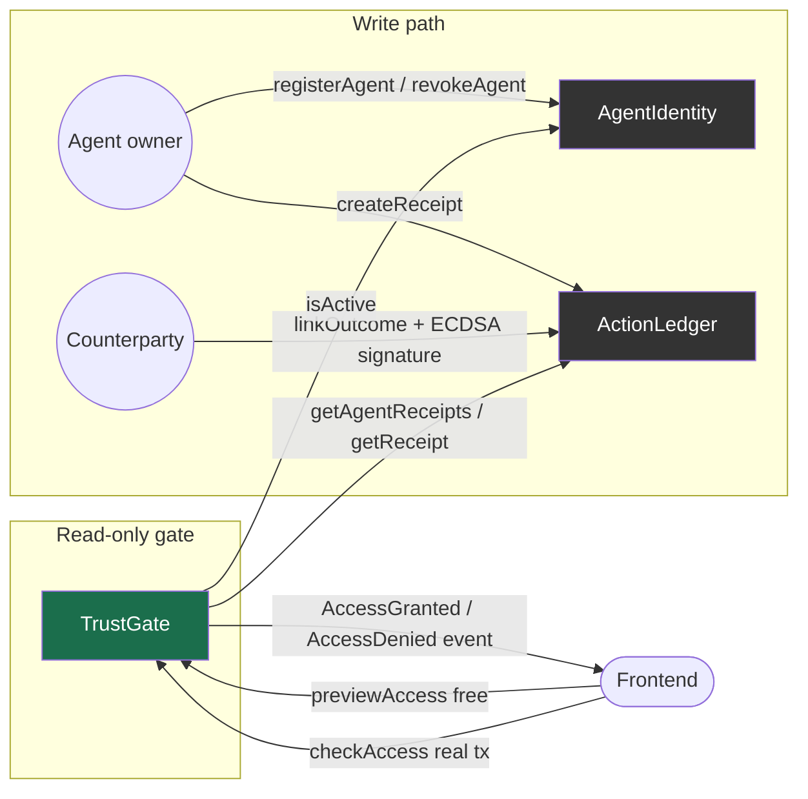
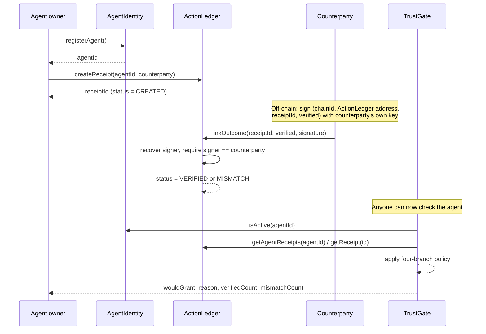

# TrustGate

An on-chain trust gate for AI agents on Monad. Access only clears when both sides of an interaction cryptographically sign off — an agent can never write its own history.

Built for Monad Blitz@北京 V2, 2026-08-15. Live demo: [trust-gate-flax.vercel.app](https://trust-gate-flax.vercel.app) (scan the QR code on the demo page to open it on your phone). Full design rationale and requirements trace: [PLAN.md](./PLAN.md).

## The problem

A 2026 empirical study of the ERC-8004 Reputation Registry ([arxiv.org/abs/2606.26028](https://arxiv.org/abs/2606.26028)) found 59.2%-90.6% of on-chain agent feedback shows Sybil patterns, because feedback is self-reported and never grounded in a verifiable interaction. Reputation exists on paper; it carries no real signal.

TrustGate fixes the specific failure mode: an interaction's outcome only becomes `VERIFIED` or `MISMATCH` once the counterparty signs off with their own key. The agent alone can never resolve its own receipt.

## How it works

Three independent contracts, each doing one job. `TrustGate` only ever _reads_ the other two — it never writes to `AgentIdentity` or `ActionLedger`, so the access policy and the underlying history stay fully decoupled.



- **`AgentIdentity`** — registers agents, tracks active/revoked status. Owns nothing else.
- **`ActionLedger`** — records receipts between an agent and a counterparty. A receipt only resolves to `VERIFIED` or `MISMATCH` when the counterparty's own signature recovers against the receipt data (chain id + contract address + receipt id + verdict — domain-separated so a signature harvested from one deployment, a redeploy, a local run, or a second chain, can never resolve a same-numbered receipt elsewhere). The agent's own owner can never create a receipt naming itself as counterparty — otherwise a third party could permanently blacklist another agent with a self-signed `MISMATCH`, or an agent could self-attest a fraudulent `VERIFIED`.
- **`TrustGate`** — read-only over the other two. `previewAccess` (free view call, never reverts) and `checkAccess` (the real transaction) run the _exact same_ four-branch policy, evaluated in order, so the two can never disagree:
  1. Agent revoked or never registered → deny, `AGENT_REVOKED`
  2. Any `MISMATCH` receipt on record → deny, `MISMATCH_ON_RECORD` (one-vote veto, not an averaged score — ten clean receipts don't dilute one flagged one)
  3. Zero `VERIFIED` receipts → deny, `INSUFFICIENT_HISTORY`
  4. Otherwise → grant

### Bilateral-signature flow

The mechanism end to end, for one interaction between an agent and a counterparty:



`previewAccess` runs this whole sequence as a free read with no wallet needed; `checkAccess` runs it as a real transaction and emits `AccessGranted` / `AccessDenied` for anyone watching the chain.

## Live on Monad testnet

Deployed and seeded — not a design sketch. Chain id `10143`:

| Contract        | Address                                                                                                                              |
| --------------- | ------------------------------------------------------------------------------------------------------------------------------------ |
| `AgentIdentity` | [`0xC51AB4dF12A2a2F293fc4e90B1C5e6bB8D147095`](https://testnet.monadexplorer.com/address/0xC51AB4dF12A2a2F293fc4e90B1C5e6bB8D147095) |
| `ActionLedger`  | [`0x2Fc2Cac0Ec46c8a0C6da5aD66a7F0610678A9dD6`](https://testnet.monadexplorer.com/address/0x2Fc2Cac0Ec46c8a0C6da5aD66a7F0610678A9dD6) |
| `TrustGate`     | [`0xA5e2c58B32F92825389E5B038aA4E8c69E6B5818`](https://testnet.monadexplorer.com/address/0xA5e2c58B32F92825389E5B038aA4E8c69E6B5818) |
| `AgentNotes`    | [`0x216C15BdfE93a2B57f61A74c8B8a9eb893550928`](https://testnet.monadexplorer.com/address/0x216C15BdfE93a2B57f61A74c8B8a9eb893550928) |

Three demo agents are seeded with real bilaterally-signed history (`scripts/seed-history.ts`, results in `deployments/seed-history.monad.json`): one clean grant, one flagged by a disputed receipt, one brand new with no history yet.

The demo page's "free preview" button needs no wallet and costs no gas — `previewAccess` and `checkAccess` run identical contract logic, so the preview shows the exact same `GRANT`/`DENY` verdict and reason a real transaction would produce; only the transaction hash is missing. Connecting a wallet and running "gate on-chain" produces a real signed transaction with a link to the explorer, for anyone who wants to verify it happened.

Each agent's one-line description in the UI is **not** hardcoded frontend copy — it's read live from `AgentNotes.noteOf(agentId)` (`scripts/seed-notes.ts`), a small contract kept separate from the access-control logic specifically so the already-tested `TrustGate`/`ActionLedger`/`AgentIdentity` trio never had to change. The app links directly to the `AgentNotes` contract on the explorer so anyone can confirm the description text was actually written on-chain, not invented client-side.

## Honest limitation

The bilateral-signature model defeats a lone liar: an agent can never write a `VERIFIED` receipt about itself. It does **not** defeat collusion — if the same operator controls both the agent's wallet and the counterparty's wallet, they can sign a perfectly valid, mutually-confirmed fake history. This is a disclosed scope boundary, not an oversight: catching collusion needs a different mechanism (e.g. staked deposits with a slashing challenge), and building that correctly in a one-day hackathon would have come at the cost of the core mechanism actually working end to end. See [PLAN.md](./PLAN.md) for the full design rationale.

## Tech stack

- **Contracts**: Solidity 0.8.24, OpenZeppelin 5.6.1, Hardhat 2.29 + TypeScript + ethers v6, targeting Monad testnet (chain id `10143`, EVM `cancun`)
- **Frontend**: Vite + React 19 + TypeScript + Tailwind v4, ethers v6, plain injected-wallet connect (Rabby/MetaMask, no wallet-connection library), zh/en toggle (defaults to en — most Web3/judge traffic reads English first), mobile-first with a static embedded QR code linking to the live demo

## Running it

### Contracts

```bash
npm install
npx hardhat test              # 26 tests: PLAN.md's scenarios + review-driven coverage
npx hardhat compile
```

Deploying to Monad testnet requires a funded wallet's private key in `.env` (see `.env.example` — never commit this file):

```bash
cp .env.example .env          # fill in PRIVATE_KEY
npm run deploy:monad          # AgentIdentity -> ActionLedger -> TrustGate, in order
npm run seed:monad            # seeds real bilaterally-signed history for the demo
npm run deploy-notes:monad    # AgentNotes — separate contract, on-chain agent descriptions
npm run seed-notes:monad      # writes each demo agent's description on-chain
```

All four scripts write their results to `deployments/` and self-verify (the seed scripts against `previewAccess`) before finishing.

### Frontend

```bash
cd frontend
npm install
npm run test                  # unit tests for pure-logic helpers
npm run build                 # tsc + vite build
npm run dev                   # local dev server
```

`frontend/src/lib/addresses.ts` holds the deployed contract addresses as local constants — update it after running `deploy:monad` against the real network.

## Deployment

Contracts deploy via `scripts/deploy.ts` against Monad testnet (Sourcify-verified, not Etherscan — Monad's verification service). The frontend deploys to Vercel from `frontend/`.

## Demo account

None needed — connect any wallet with Monad testnet MON (free from `https://faucet.monad.xyz`) to send the real `checkAccess` transaction. Previewing an agent's access needs no wallet at all.

## License

UNLICENSED — hackathon submission, not intended for reuse.
